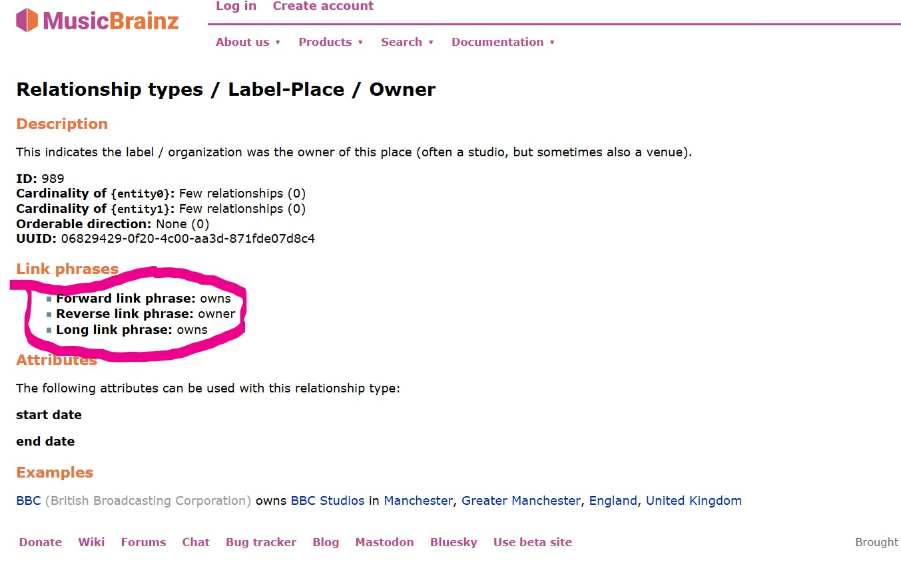

# MusicBrainz: Relationships between Entities

## Understanding MusicBrainz Relationships

### Understanding Entity-Type Restrictions

MusicBrainz Relationships ([Official Definition](https://musicbrainz.org/doc/Relationships)) are used to connect two entities. 

For example:

- an artist entity may be the `"owner"` of a label entity,
- a label entity may be the `"owner"` of a place entity. 

However, the two `"owner"` relationships, despite having the same name, refer to two distinct relationships: 

- the [first relationship](https://musicbrainz.org/relationship/610fa594-eeaa-407b-a9f1-49f509ab5559) is `artist-label/owner`, which can only exist between an artist and a label; 
- the [second relashionship](https://musicbrainz.org/relationship/06829429-0f20-4c00-aa3d-871fde07d8c4) is `label-place/owner`, which can only exist between a label and a place. 

This is due the fact that MusicBrainz, unlike Wikidata, defines each  relationship so that it can only connect two very specific entity-types: a relationship that connects artist-label CAN NOT be reused to connect label-place. 

### Understanding Property Directionality

Let's continue from our previous example: 

- Both MusicBrainz properties `artist-label/owner` and `label-place/owner` can be replaced with the same Wikidata property, since Wikidata properties are much more generalized (e.g. "has part" can be used between almost any type of entity)

- As you expect, Wikidata properties are generally much less specific to music than MusicBrainz relationships. We often must settle for a less-than-ideal match. 

Try looking for a Wikidata property for `artist-label/owner`:

- You realize that there is no "owner" or "owns" property in Wikidata

- You find [owned by(P127)](http://www.wikidata.org/prop/direct/P127). You realize that it would the inverse property of "owner". 

- You realize that most Wikidata property don't have an inverse ([part of(P361)](https://www.wikidata.org/wiki/Property:P361) & [has parts(P527)](https://www.wikidata.org/wiki/Property:P527) is an exception). That's fine: inverse properties work just as well for a graph database. 

- You wonder how inverse relationship work in MusicBrainz. What even is the inverse of `label-place/owner`? Is it `label-place/owns`? Maybe `place-label/owns`? Does it even exist?    

The image below should answer your question:

([image source](https://musicbrainz.org/relationship/06829429-0f20-4c00-aa3d-871fde07d8c4))

As you can see, each MusicBrainz property is in fact **bidirectional**: 

- The property `label-place/owner` encompasses both `owns` & `owned by`: it can mean one or the other depending on the entity-type of the subject and the entity-type of the object.  

- When used in the "forward direction" (e.g. BBC(label) `owner` BBC studio(place)), the relationship means "label `owns` place". 

- When used in the "backward direction" (e.g. BBC studio(place) `owner` BBC(label)), the property actually means 'place `owned by` label'. 

- If a forward relation exists, then a backward relation necessarily exists (except for `genre`, we'll get to it). For example, if you see <Taylor Swift\> <`main performer`> <The Eras Tour\>, you are guaranteed to find \<The Eras Tour> <`main performer`> \<Taylor Swift> in another file.

Takeaways:

- MusicBrainz relationships must be identified by the **entity-type it accepts as subject** AND the **entity-type it accepts as object**:
    - Example: artist->label--"owner", which means "owns"
    - This is different from label->artist--"owner", which means "owned by"
    - This is different from label->place--"owner", which also means "owns" but is defined as a separate relationship.

## The Process of Reconciling MusicBrainz Relationships

### Extracting Relationships from JSONL 

In the MusicBrainz dataset, a few relations between entities are kept in their own fields. For example, `artist-credit` is the field that contains the artist that contains the artist that made a recording. However, the vast majority of relationships between entities are listed in the `relationships` field. 

Given that across all entity types, there are roughly 800 different relation types that all need to be mapped, storing the mappings inside the RDF conversion script would make it very messy. 

Therefore, the script `code/musicbrainz/extract_relations.py` will parse all the JSONL data files and will extract every type relationship (e.g. siblings, master engineer)  between all entities. The result is outputted to `relations.json` (note: existing relationship will not be overwritten, only new relationships are added).

### relations.json

- It is located in `code/musicbrainz/rdf_conversion_config` 
- It is structured in `subject -> object -> relationship` format (i.e. the outermost dictionary key indicates the subject's entity type, the second dictionary key indicates the object's entity-type, and the keys of the third dictionary are the relationships). As discussed above, it is crucial for MusicBrainz relationships to be identified by what it accepts as subject and as object (e.g artist -> recording -> remixer)

- The values associated with each relationship are the Wikidata Property ID that the relationship maps to, in string format (e.g. `"P2888"`). If a relationship is to be ignored (or not mapped) by the RDF conversion script, then it should either be removed or left as `null`/`None`.

#### Note: Homogeneous Relationships

Some relationships are "homogeneous" (e.g. area -> area -> part of). 

However, as discussed before, relations.json rely on subject and object being of different type to tell the direction of relationship:

- We can tell that "owner" means "owned by" when we see `place -> label -> owner` because we can infer that place can not "own" a record label ([the documentation](https://musicbrainz.org/relationship/06829429-0f20-4c00-aa3d-871fde07d8c4) can confirm that). 

- Yet, in the case of homogeneous relationships (e.g. area -> area -> part of), we can not infer the direction of the relationship. This is rather important: "Québec being part of Canada" is different from "Canada part of Québec"

Luckily, we have a `direction` field ( containing either `forward` or `backward`) in our JSONL files:

- Thus, there exists a `{relationship}_forward` and a `{relationship}_backward` field for each homogenous relationship. It allows differentiating two inverse predicates who otherwise share the same dictionary path.

### Mapping MusicBrainz Relationships to Wikidata
  

