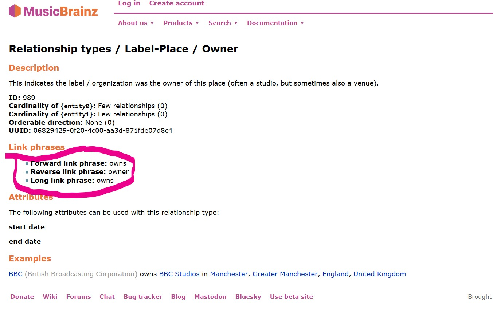

# MusicBrainz: Relationships between Entities

## Understanding MusicBrainz Relationships

### Understanding Entity-Type Restrictions

MusicBrainz Relationships ([Official Definition](https://musicbrainz.org/doc/Relationships)) are used to connect two entities.

For example:

- an artist entity may be the `"owner"` of a label entity,
- a label entity may be the `"owner"` of a place entity.

However, the two `"owner"` relationships, despite having the same name, refer to two distinct relationships:

- the [first relationship](https://musicbrainz.org/relationship/610fa594-eeaa-407b-a9f1-49f509ab5559) is `artist-label/owner`, which can only exist between an artist and a label;
- the [second relashionship](https://musicbrainz.org/relationship/06829429-0f20-4c00-aa3d-871fde07d8c4) is `label-place/owner`, which can only exist between a label and a place.

This is due the fact that MusicBrainz, unlike Wikidata, defines each relationship so that it can only connect two very specific entity-types: a relationship that connects artist-label CAN NOT be reused to connect label-place.

### Understanding Property Directionality

Continuing from our previous example:

- Both MusicBrainz properties `artist-label/owner` and `label-place/owner` can likely be replaced by the same Wikidata property, since Wikidata properties are much more generalized.

- As expected, Wikidata properties are much less specific to music than MusicBrainz relationships. We often must settle for a less-than-ideal match.

Try looking for a Wikidata property for `artist-label/owner`. You will probably go through the following steps:

- Realizing that there is no "owner" or "owns" property in Wikidata

- Finding [owned by(P127)](http://www.wikidata.org/prop/direct/P127), and realizing that it would be the inverse property of "owner".

- Understanding that most Wikidata property don't have an inverse ([part of(P361)](https://www.wikidata.org/wiki/Property:P361) & [has parts(P527)](https://www.wikidata.org/wiki/Property:P527) are exceptions). Understanding that this inverse properties are not really needed for a graph database with a SPARQL endpoint.

- Wondering how inverse relationship work in MusicBrainz. What even is the inverse of `label-place/owner`? Is it `label-place/owns`? Maybe `place-label/owns`? Does it even exist?  

This image below should explain how inverse relationships work in MusicBrainz:

([image source](https://musicbrainz.org/relationship/06829429-0f20-4c00-aa3d-871fde07d8c4))

As you can see, each MusicBrainz property is in fact **bidirectional**:

- The property `label-place/owner` encompasses both `owns` & `owned by`: it can mean one or the other depending on the entity type of the subject and the entity type of the object.

- When used in the "forward direction" (e.g., BBC `owner` BBC studio), the relationship means "label `owns` place".

- When used in the "backward direction" (e.g., BBC studio `owner` BBC), the property actually means 'place `owned by` label'.

- If a forward relation exists, then a backward relation necessarily exists (except for `genre`; we'll get to it). For example, if you see (Taylor Swift->`main performer`->The Eras Tour), you are guaranteed to find (The Eras Tour->`main performer`->Taylor Swift) in another file.

Takeaways:

- MusicBrainz relationships must be identified by the **entity type it accepts as subject** AND the **entity type it accepts as object**:  

- Example:
    - `artist->label--"owner"` means "owns"
    - It is different from `label->artist--"owner"`, which means "owned by"
    - It is different from `label->place--"owner"`, which also means "owns", but is defined as a separate relationship.

## The Process of Reconciling MusicBrainz Relationships

### Extracting Relationships from JSONL

In the MusicBrainz dataset, the vast majority of relationships between entities are listed in the `relationships` field.

A few relations are kept in their own fields, such as `artist-credit`, which is the field containing all artists credited for a recording. These relations will be handled separately. 

Given that across all entity types, there are roughly 800 different relation types that all need to be mapped to Wikidata, storing the mappings inside the RDF conversion script would make it very messy.

Therefore, the script `code/musicbrainz/extract_relations.py` will parse all the JSONL data files and will extract every type relationship (e.g. siblings, master engineer) between all entities. 

The result is outputted to `relations.json`, to which we can add Wikidata PIDs manually (note: the script may add missing properties to an existing relations.json, but will not modify any property and mapping that already exists in the json).

### relations.json

- It is located in `code/musicbrainz/rdf_conversion_config`
- It is a needed as an input of `convert_to_rdf.py`
- Each property in `relations.json` is structured in `subject -> object -> relationship` format (i.e. the outermost dictionary key indicates the subject's entity type, the second dictionary key indicates the object's entity-type, and the keys of the third dictionary is the relationship name). As discussed above, it is crucial for MusicBrainz relationships to be identified by what it accepts as subject and as object (`artist -> recording -> remixer` would stand for one relationship)

- The values associated with each relationship are the Wikidata Property ID that the relationship maps to, in string format (e.g. `"P2888"`). If a relationship has no equivalent in Wikidata, it should either be removed or left as `null`/`None`: this would ensure that it is ignored by the RDF conversion script,

#### Note: Same-Type Relationships

Some relationships link two entities of the same type (e.g. area -> area -> part of).

However, as discussed before, relations.json relies on subject and object being of different type to tell the direction of relationship:

- We can tell that "owner" means "owned by" when we see `place -> label -> owner` because we can infer that a place can not "own" a record label ([the documentation](https://musicbrainz.org/relationship/06829429-0f20-4c00-aa3d-871fde07d8c4) can confirm that).

- Yet, in the case of same-type relationships (e.g. area -> area -> part of), we can not infer the direction of the relationship. This is rather important: "Québec is part of Canada" is different from "Canada is part of Québec". Not only that, those two relationships, inverse of each other, would share the same path (`relations.json["area"]["area"]["part of"]`).

To solve this problem:

- We replace each same-type relationship in `relations.json` with `{relationship}_forward` and a `{relationship}_backward` field. This would ensure that there exists `relations.json["area"]["area"]["part of_forward"]` and `relations.json["area"]["area"]["part of_backward"]`, which are inverse of each other.

- Our fetched JSONL contain a `direction` field ( containing either `forward` or `backward`). We can use them to map same-type relationships the right direction.

- Often, you will need to consult MusicBrainz documentation because it is can be obscure what a relationship mean in forward or backward context. For example, it may not be obvious that [artist->artist->is person_forward](https://musicbrainz.org/relationships/artist-artist) would mean that an artist-entity `performs as` another artist-entity, and that the object would be the stage name of the subject.

#### Note: Genres

Despite being considered an entity by the [MusicBrainz relationships table](https://musicbrainz.org/relationships), genre is not an entity present in the MusicBrainz dump. Thus, you will only find genre as the object in `relations.json`, never as subject.

However, all equivalent Wikidata properties relating to genres require the `genre` as subject. Therefore, the RDF conversion script would exceptionally interpret `relations.json[any_type]["genre"][any_property]` to be a `genre -> any_type -> any_property`.

### Mapping MusicBrainz Relationships to Wikidata

Only 409 of the roughly 800 fields in `relations.json` are currently filled. The empty fields are largely due to the fact that most Wikidata properties do not have an equivalent inverse (as mentionned above).

All in all, 98% of all the relationships in MusicBrainz have at least one direction mapped to Wikidata. The missing 2% tend to be not widely used relationships, so should represent an even smaller share of total existing relations.

However, since Wikidata is not as specialized for music as MusicBrainz, there is inevitably some loss of accuracy.

OpenRefine only allows reconciliation of items (with QID), but not reconciliation of properties (PID). However, the Wikidata Search API allow searching through Wikidata ElasticSeach engine. 

(I will elaborate this section of the documentation in another pull request on documentation for Wikidata APIs)

Below I will explain a few Wikidata properties that I have mapped onto frequently:

- location of creation(P1071)

  - A generic Wikidata property that encompasses all the different MusicBrainz location properties (e.g. "edited in", "remixed in", "engineered in", "composed in"). 

- contributor to the creative work or subject(P767)

  - A generic property for contributors whose role is too specific to exist in Wikidata (e.g. "field recordist", "mix-DJ", "remixer").

  - Though we usually say "this artist is the illustrator of this album", `"performer(P175)"`, `"illustrator(P110)"` or any similar Wikidata property for contributors need the person as object. It is better to understand them as `"has performer"` and `"has illustrator"`.

- employer(P108)

  - A generic property used to express that a person's role at an event or at an place (i.e. institution)  does not exist in Wikidata. Any such role on a release, recording, or work (i.e. composition) would instead use `contributor to the creative work or subject(P767)` 

  - Example: I would use "artist -> `employer(P108)` -> place" to express that an artist is a `composer-in-residence` at a place, since this `composer-in-residence` does not exist as a Wikidata property.

  - Contrasting Example: For school director, I would map it to "place -> `director / manager(P1037)` -> artist " instead. I avoid using `employer(P108)` whenever there is a more specific relationship.

  - A potential improvement to make our properties more accurate is to add qualifiers on top of generic properties (there is currently no way to specify qualifiers in relations.json, we would have to refactor convert_to_rdf.py). Taking for example [J.S. Bach](https://www.wikidata.org/wiki/Q1339), we can see that J.S. Bach's relation with his employers are often supplemented by the qualifier "Bach(Q1339) -> `position held(P31)` -> organist(Q765778)", meaning that Bach was an organist for his employer.

- part of(P361) & has part(s)(P527)

  - Very versatile properties that can relate entities of almost any type.

  - Example: band `has part(s)(P527)` band members

  - Example: track `part of(P361)` album

- adapted by(P5202)

  - Commonly used Wikidata property for "arranger". 
  - `orchestrator(P10806)` can only be used if the musical work is being adapted for orchestra.
