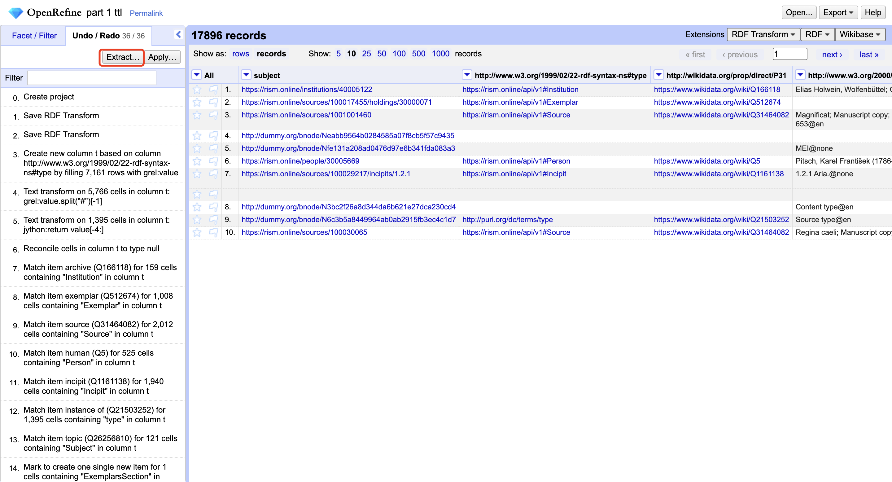
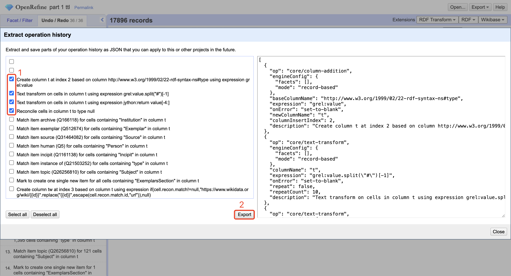
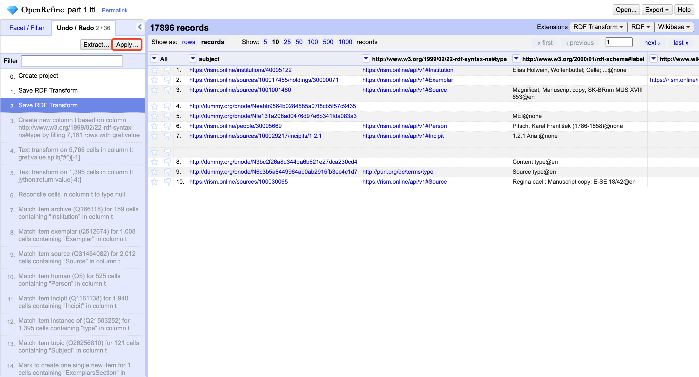
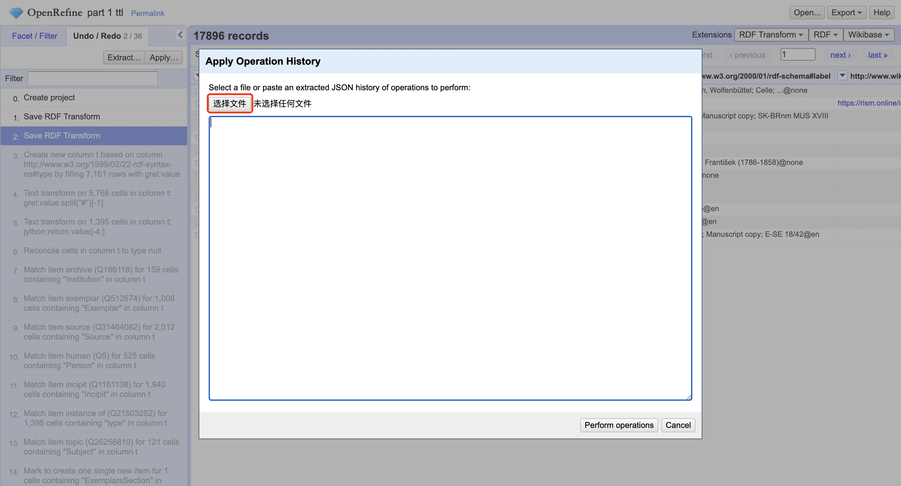
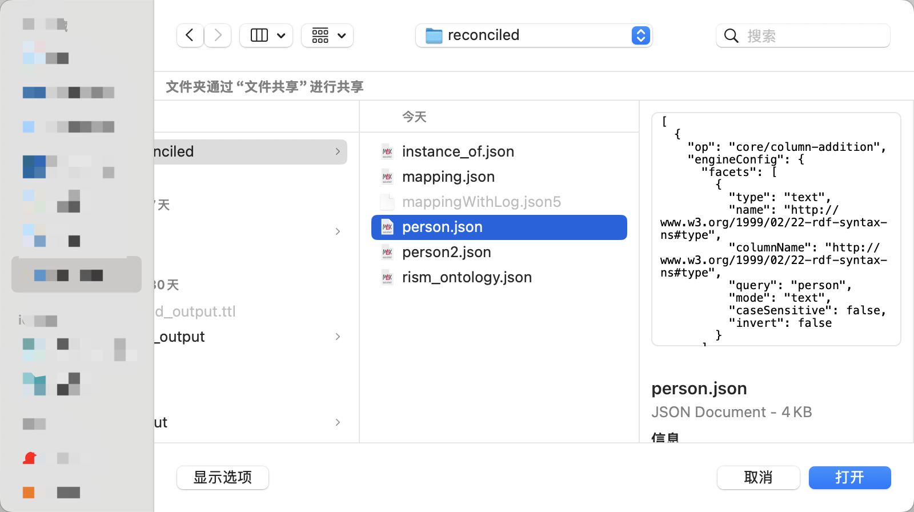
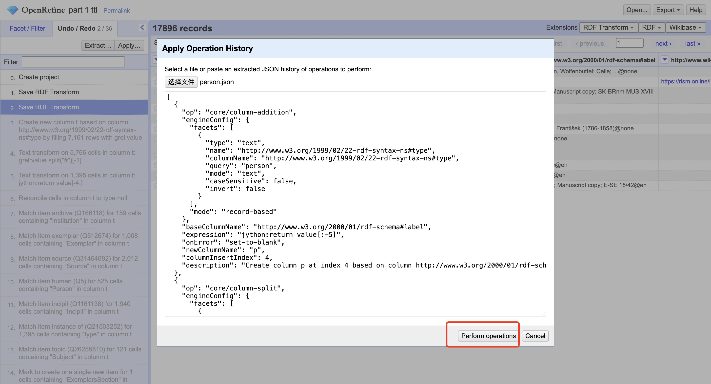

#  Extracting and Applying Steps

### Extracting
- You can extract a sequence of steps in OpenRefine to facilitate your workflow.

- Select a sequence of steps you want to keep

- A .json file should appear in your browswer's download folder. This contains all the steps you chose. Keep this for further use.
> Do not change what's inside unless you know what you're doing.

### Applying
- You can apply the sequence of steps that you kept.

- Choose the .json file that contains the steps you want to perform on your project.

- Now wait until OpenRefine is finished, and the sequence of steps will be applied.
