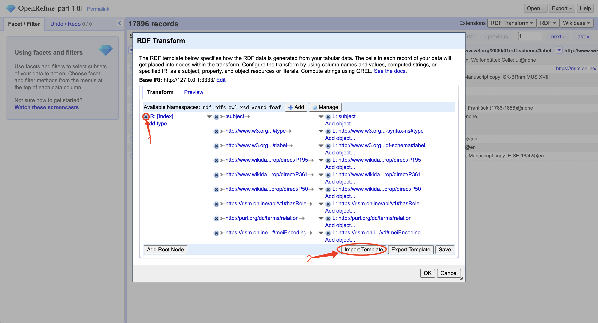
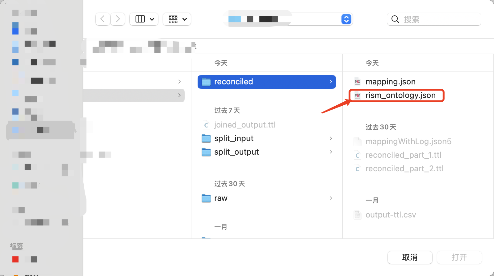
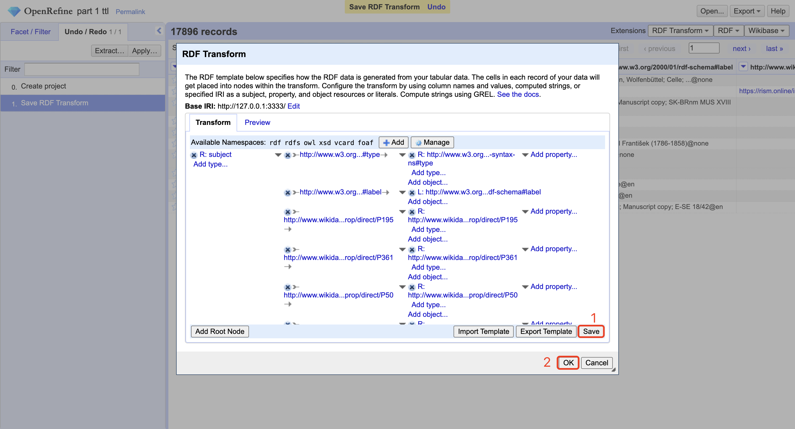
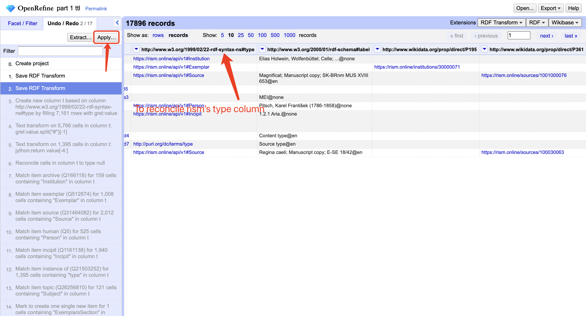
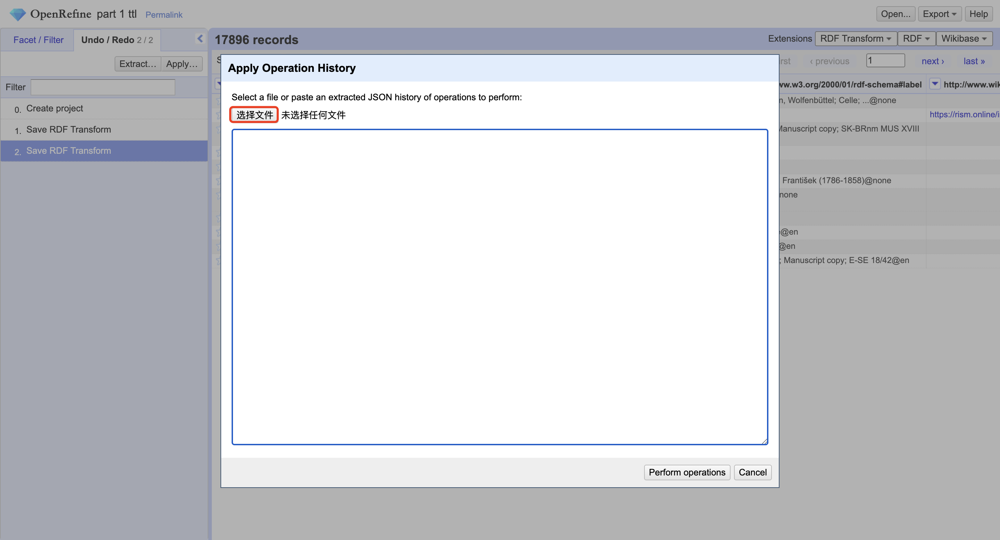
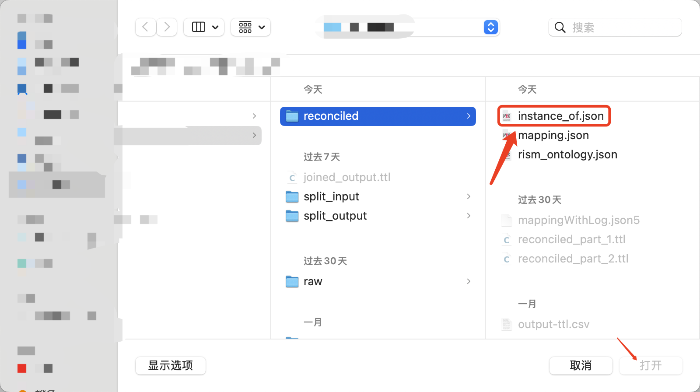
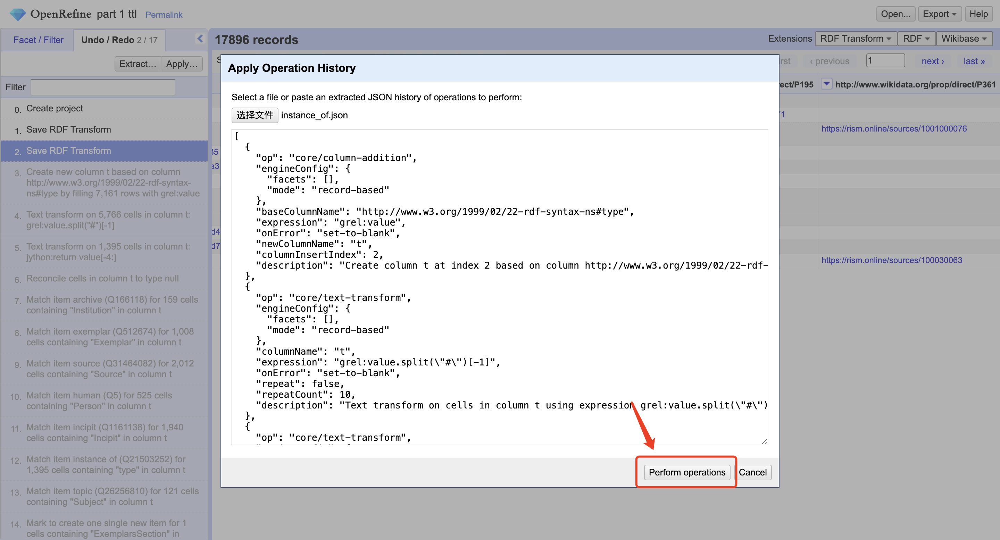
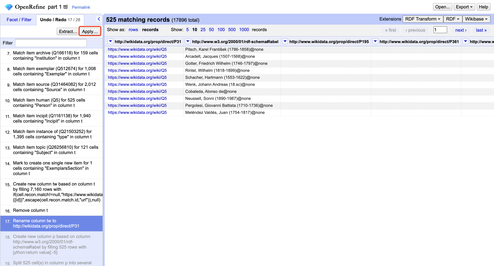
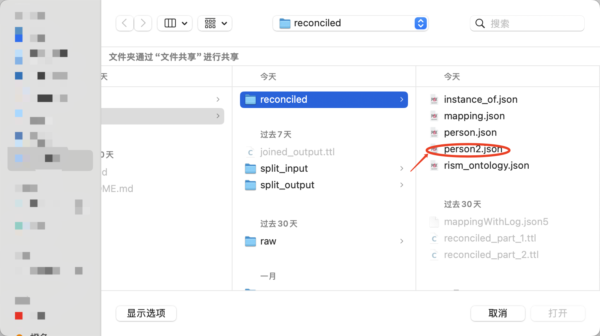

# RISM Data Processing Guide

This document explains the process for handling RISM (Répertoire International des Sources Musicales) data provided by Andrew Hankinson.

## Prerequisites

### OpenRefine Setup
1. Install [OpenRefine](https://openrefine.org/), version 3.9 or later.
2. Install [RDF-transform](https://github.com/AtesComp/rdf-transform) to convert OpenRefine project data to RDF-based formats using the RDF-extension.
> Note: the RDF-transform extension does not work on browsers Firefox or Safari.

### Mapping Configuration
- Review the mapping file at `/linkedmusic-datalake/code/rism/ontology/mapping.json`.
- Detailed mapping decisions are documented in `/linkedmusic-datalake/code/rism/ontology/mappingWithLog.json5`.

## Processing Workflow

### 1. Splitting the Graph
1. Open a terminal in the `linkedmusic-datalake` directory.
2. Navigate to `./code/rism`.
3. Run the splitting script using:
    - `python3 force_split.py` to use the default 500MB chunk size, or
    - `python3 force_split.py [size]` to specify a custom chunk size (e.g., `python3 force_split.py 500` for 500MB).
    > Note: ensure the path to input_file and output_dir are configured properly within the `__main__` function of `force_split.py`. The processed files with corrected predicates will by default be saved to `/linkedmusic-datalake/data/rism/split_output`. It is highly recommended to store the data files outside of this github repo.

### 2. Processing with OpenRefine
> Note: Red circles or rectangles in the screenshots indicate the elements you need to click. Other annotations are for reference only.

For each file in the `split_output` directory (e.g., `part_1.ttl`, where all blank nodes from the original RDF n-triples file have been converted to specific URIs):

1. **Create a New OpenRefine Project**:
    - Open the target file located within your `split_output` directory e.g., `/linkedmusic-datalake/data/rism/split_output/part_1.ttl`.

2. **Apply the RDF Skeleton for RISM**:
    > Follow the instructions in sequential order:
    
    

    > Note: The ontology file has been moved to `/linkedmusic-datalake/code/rism/ontology`.

    
    

3. **Reconcile the Type Column**:
    
    
    
    Use the `instance_of.json` file located in `/linkedmusic-datalake/code/rism/openrefine`.

    > Note: The OpenRefine step files used to be in `rism/data/reconciled`.

    

    > Note: OpenRefine may prompt you to select the file multiple times due to a bug. Simply reselect the same file each time.

    

4. **Reconcile All Cells of the "Label" Predicates for Human/Person Subjects**:
    
    

5. **Apply Judgments to Unreconciled Cells**:
    > **IMPORTANT**: Make informed decisions for unreconciled cells. This repository does not include predefined judgments, as this process is for testing purposes.
    
    

6. **Reconcile Other Relevant Columns** using the other json files located in `/linkedmusic-datalake/code/rism/openrefine`.

7. **Export the RDF Data**:
    

8. **Repeat Steps 1-7** for all remaining files located in the designated split output folder, by default located at `/linkedmusic-datalake/data/rism/split_output/`.

9. **Store All Reconciled Files** (in `.nt` format) within a folder titled `split_input` (e.g. on your desktop).

> In some cases, the output file might be empty due RDF-transform error.
> Reapply the RDF transform (repeat step 2) if you encounter an output error.

### 3. Joining the Processed Files
1. Navigate to `/linkedmusic-datalake/code/rism/`.
2. Run `python3 force_join.py`.
> Note: ensure the path to input_file and output_dir are configured properly within the `__main__` function of `force_join.py`. The final output will by default be created at `/linkedmusic-datalake/data/rism/joined_output.ttl`. It is highly recommended to store the data files outside of this github repo.

The joined file represents the complete processed RISM dataset.

### Others
mappingWithLog.json5 records the logs or comments for reconciliation of properties or types.
