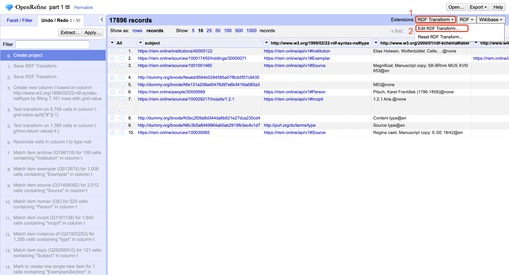
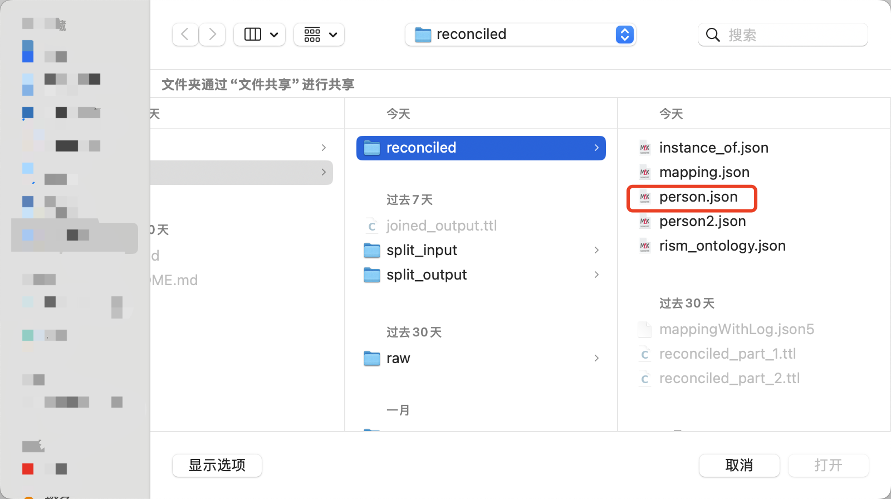
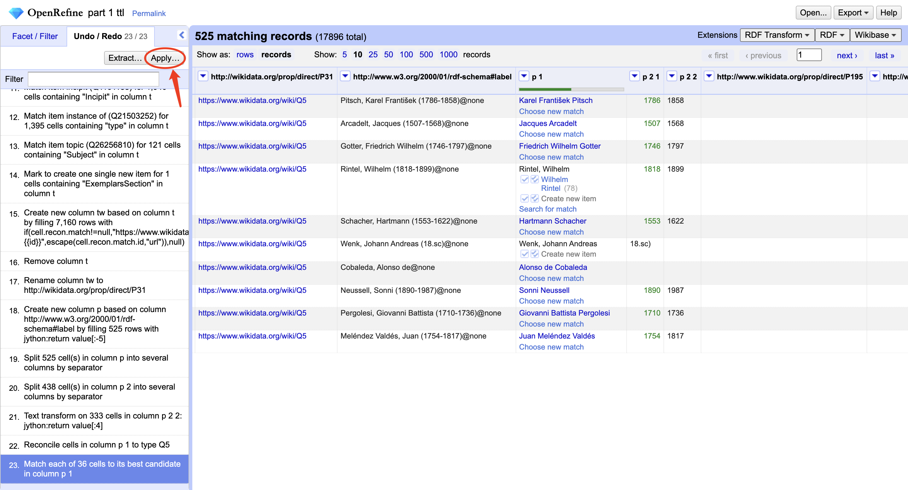
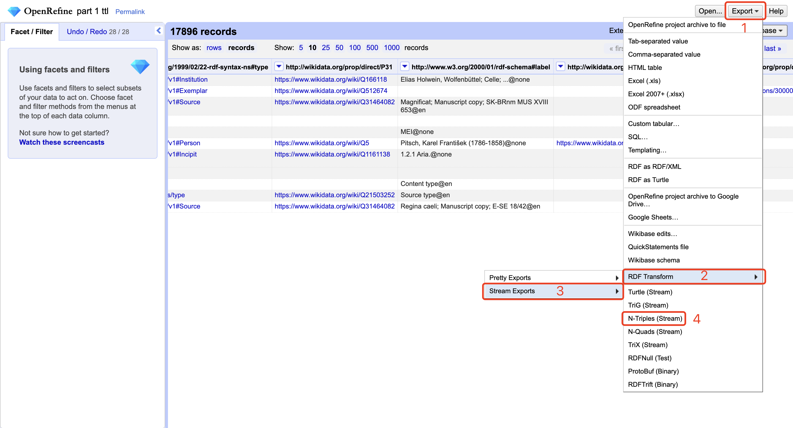

# RISM Data Processing Guide

This document explains the process for handling RISM (Répertoire International des Sources Musicales) data provided by Andrew Hankinson.

## Prerequisites

### OpenRefine Setup
1. Install [OpenRefine](https://openrefine.org/), version 3.9 or later.
2. Install the [RDF-extension](https://github.com/stkenny/grefine-rdf-extension).
3. Install [RDF-transform](https://github.com/AtesComp/rdf-transform) to convert OpenRefine project data to RDF-based formats using the RDF-extension.

### Mapping Configuration
- Review the mapping file at `/linkedmusic-datalake/data/rism/reconciled/mapping.json`.
- Detailed mapping decisions are documented in `/linkedmusic-datalake/data/rism/reconciled/mappingWithLog.json5`.

## Processing Workflow

### 1. Splitting the Graph
1. Open a terminal in the `linkedmusic-datalake` directory.
2. Navigate to `./code/rism`.
3. Run the splitting script using:
    - `python3 force_split.py` to use the default 500MB chunk size, or
    - `python3 force_split.py [size]` to specify a custom chunk size (e.g., `python3 force_split.py 500` for 500MB).
4. The processed files with corrected predicates will be saved to `/linkedmusic-datalake/data/rism/split_output`.

### 2. Processing with OpenRefine
> Note: Red circles or rectangles in the screenshots indicate the elements you need to click. Other annotations are for reference only.

For each file in the `split_output` directory (e.g., `part_1.ttl`, where all blank nodes from the original RDF n-triples file have been converted to specific URIs):

1. **Create a New OpenRefine Project**:
    - Open the file located at `/linkedmusic-datalake/data/rism/split_output/part_1.ttl`.

2. **Apply the RDF Skeleton for RISM**:
    > Follow the instructions in sequential order:
    
    

    > Note: The ontology file has been moved to `/linkedmusic-datalake/code/rism/ontology`.

    
    

3. **Reconcile the Type Column**:
    
    
    
    Navigate to `rism/data/reconciled`:

    > Note: The OpenRefine step files have been moved to `/linkedmusic-datalake/code/rism/openrefine`.

    

    > Note: OpenRefine may prompt you to select the file multiple times due to a bug. Simply reselect the same file each time.

    

4. **Reconcile All Cells of the "Label" Predicates for Human/Person Subjects**:
    
    

5. **Apply Judgments to Unreconciled Cells**:
    > **IMPORTANT**: Make informed decisions for unreconciled cells. This repository does not include predefined judgments, as this process is for testing purposes.
    
    

6. **Reconcile Other Relevant Columns** as needed (refer to the step history for guidance).

7. **Export the RDF Data**:
    

8. **Repeat Steps 1-7** for all remaining files in `/linkedmusic-datalake/data/rism/split_output/`.

9. **Move All Reconciled Files** (in `.nt` format) to `/linkedmusic-datalake/data/rism/split_input/`.

> In some cases, the output file might be empty due RDF-transform error.

10. **Preventing Output Errors**: Reapply the RDF transform (repeat step 2) if you encounter an output error.

### 3. Joining the Processed Files
1. Navigate to `/linkedmusic-datalake/code/rism/`.
2. Run `python3 force_join.py`.
3. The final output will be created at `/linkedmusic-datalake/data/rism/joined_output.ttl`.
4. The joined file represents the complete processed RISM dataset.

### Others
mappingWithLog.json5 records the logs or comments for reconciliation of properties or types.