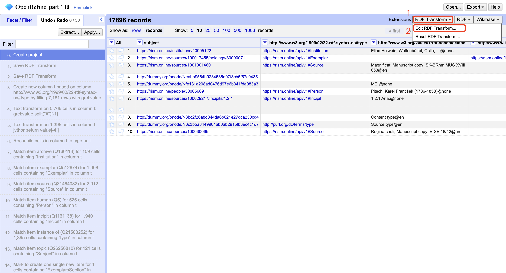

# RISM Data Processing Guide

This document outlines the process for handling RISM (Répertoire International des Sources Musicales) data provided by Andrew Hankinson.

## Prerequisites

### OpenRefine Setup
1. Install [OpenRefine](https://openrefine.org/)
2. Install the [RDF-extension](https://github.com/stkenny/grefine-rdf-extension) for exporting OpenRefine data in RDF format
3. Install [RDF-transform](https://github.com/AtesComp/rdf-transform) for transforming OpenRefine project data to RDF-based formats

### Mapping Configuration
- Review the mapping file at `/linkedmusic-datalake/rism/data/reconciled/mapping.json`
- Detailed mapping decisions are documented in `/linkedmusic-datalake/rism/data/reconciled/mappingWithLog.json5`

## Processing Workflow

### 1. Splitting the Graph
1. Open a terminal in the `linkedmusic-datalake` directory
2. Navigate to `./rism/code`
3. Run the splitting script using either:
    - `python3 force_split.py` for the default 500MB chunk size
    - `python3 force_split.py [size]` for a custom chunk size (e.g., `python3 force_split.py 500` for 500MB)
4. The processed files with corrected predicates will be saved to `/linkedmusic-datalake/rism/data/split_output`

### 2. Processing with OpenRefine
> Note: Red circles or rectangles in screenshots indicate elements you need to click on. Other annotations are for reference only.

For each file in the split_output directory (starting with `part_1.ttl`):

1. **Create a new OpenRefine project**:
    - Open the file from `/linkedmusic-datalake/rism/data/split_output/part_1.ttl`

2. **Apply the RDF skeleton for RISM**:
    
    
    
    

3. **Reconcile the type column**:
    
    
    
    > Note: OpenRefine has a bug at this step where it may prompt you to select the file multiple times. Simply select the same file each time when prompted.
    

4. **Reconcile all names for Human/Person subjects**:
    
    

5. **Apply judgment to unreconciled cells**:
    > **IMPORTANT**: Make your own informed decisions for unreconciled cells. The repository does not contain predefined judgments as this is for testing purposes.
    
    

6. **Reconcile other relevant columns** as needed (refer to the step history for guidance)

7. **Export the RDF data**:
    

8. **Repeat steps 1-7** for all remaining files in `/linkedmusic-datalake/rism/data/split_output/`

9. **Move all reconciled files** (`.nt` format) to `/linkedmusic-datalake/rism/data/split_input/`

### 3. Joining the Processed Files
1. Navigate to `/linkedmusic-datalake/rism/code`
2. Run `python3 force_join.py`
3. The final output will be created at `/linkedmusic-datalake/rism/data/joined_output.ttl`
4. This joined file is the complete processed RISM dataset
