# Data Source: from RISM agent (Andrew Hankinson)

# Steps

### Preparing OpenRefine
- Install OpenRefine
- Install RDF-extension based on <https://github.com/stkenny/grefine-rdf-extension> which is for exporting data of OpenRefine projects in RDF format
- Install RDF-transform based on <https://github.com/AtesComp/rdf-transform> which is for transforming OpenRefine project data to RDF-based formats

### Preparing the mapping file
- Check `/linkedmusic-datalake/rism/data/reconciled/mapping.json`
- Decisions details are in `/linkedmusic-datalake/rism/data/reconciled/mappingWithLog.json5`

### Splitting the graph:
- Open a terminal at `linkedmusic-datalake` folder
- cd into `./rism/code`
- run `python3 force_split.py` for default chunk size 1000MB.
- run `python3 force_split.py ${size}` for custom chunk size.
- files with correct predicates replaces should be in `/linkedmusic-datalake/rism/data/split_output`

### OpenRefine
1. Open `/linkedmusic-datalake/rism/data/split_output/part_1.ttl` and create project.
2. To apply the RDF skeleton for RISM:
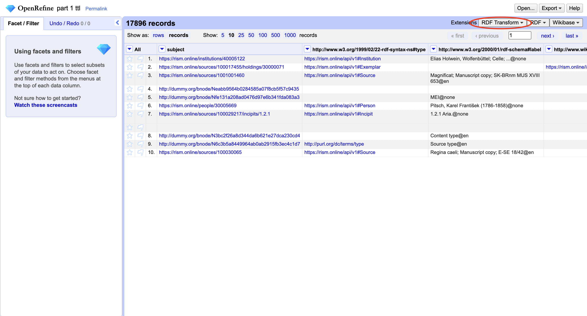
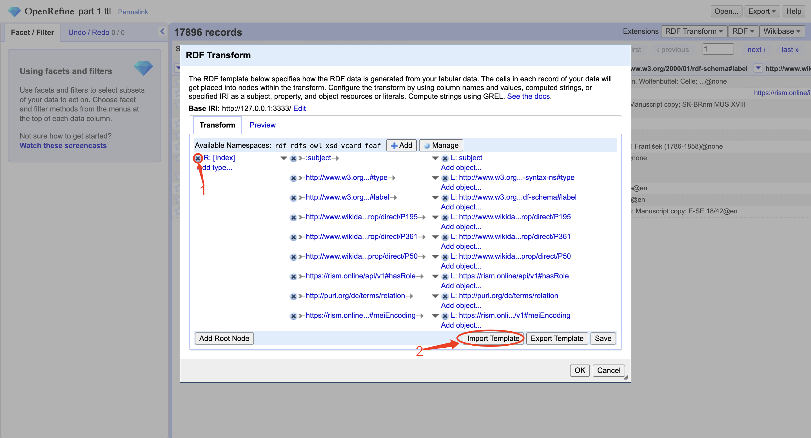
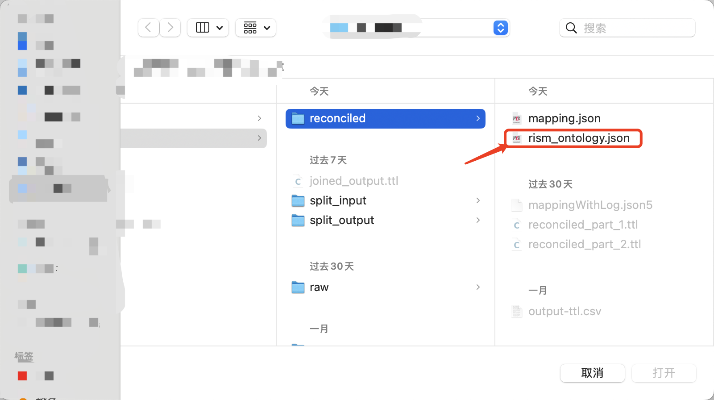
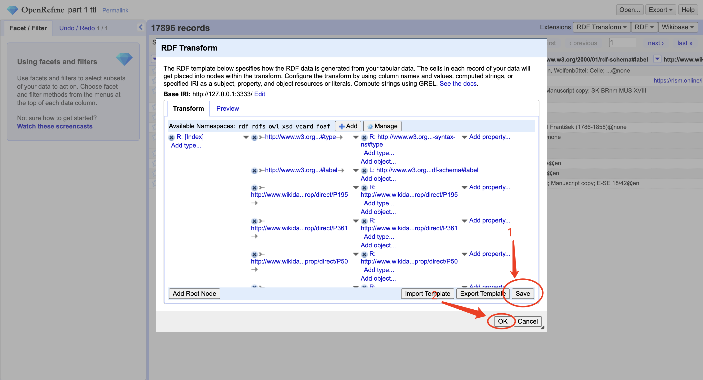
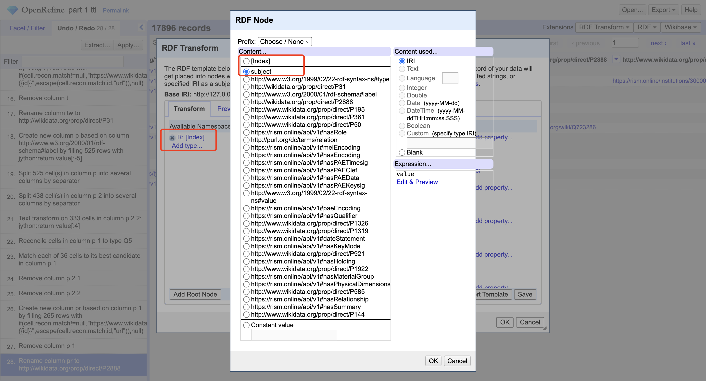
3. To reconcile the type column:

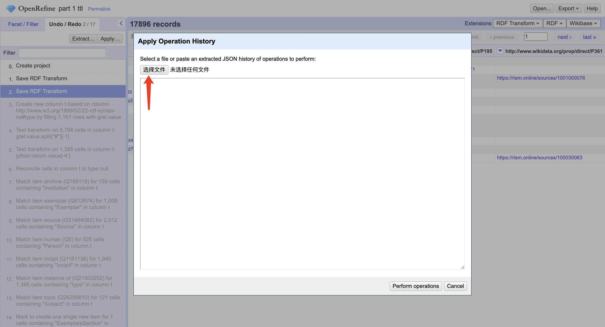
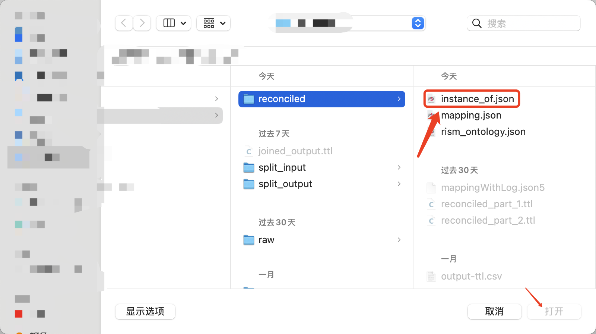
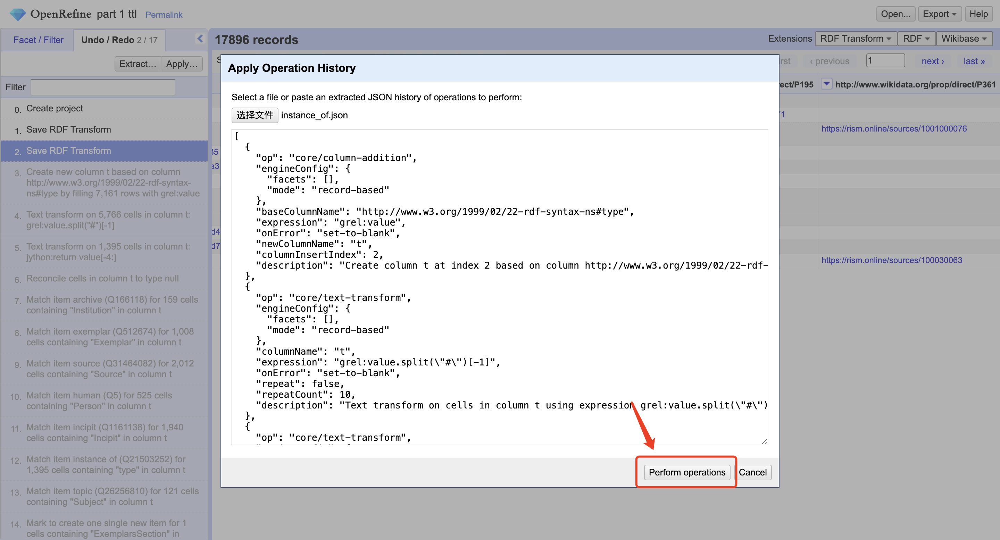
4. To reconcile all names for Human/Person subjects:
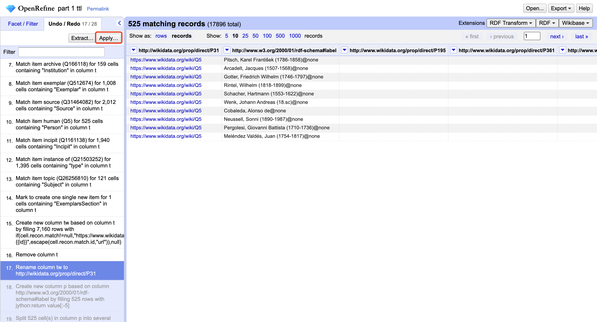
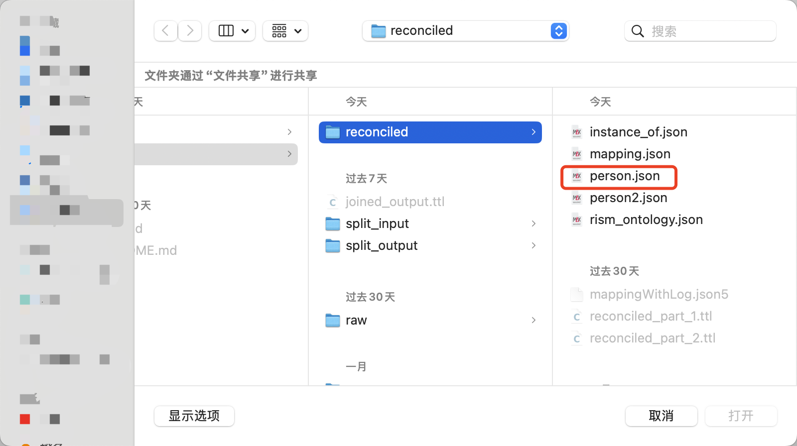
5. Now perform your own judges for unreconciled cells. After you finish your choices, preceed to:
> ***NOTE: No accurate judges in this repo are made based on testing purposes. Please make your own decisions!***
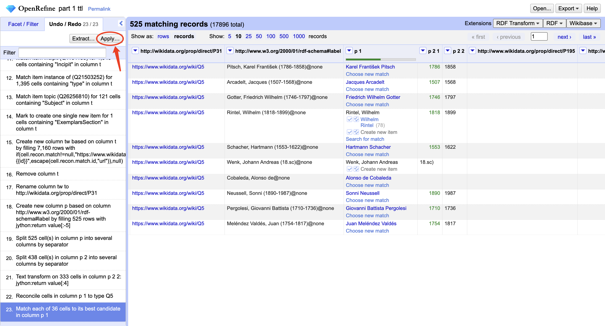
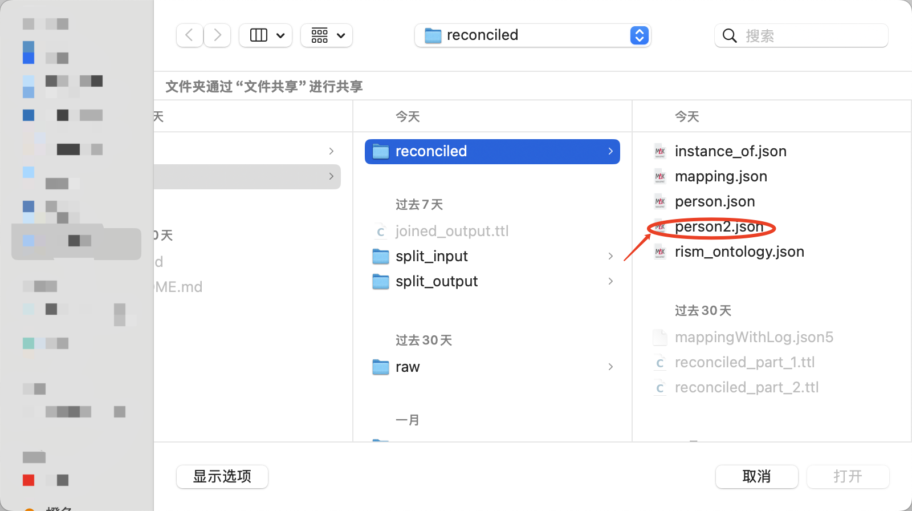
6. Reconcile other columns that you think is necessary. You can refer to the steps history.
7. Output the file based on the RDF skeleton.
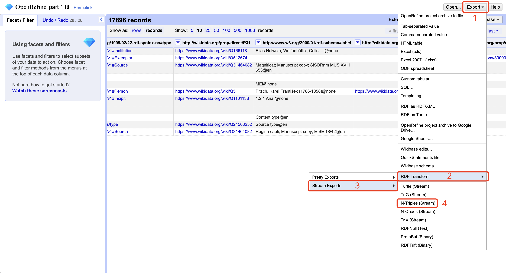
8. Repeat steps 1-6 for all other files in `/linkedmusic-datalake/rism/data/split_output/`.
9. Move all of the reconciled `.nt` files into `/linkedmusic-datalake/rism/data/split_input/`.

### Force join
- cd into `/linkedmusic-datalake/rism/code`.
- run `python3 force_join.py`
- You should see `/linkedmusic-datalake/rism/data/joined_output.ttl`.
- This is the final output for RISM.
